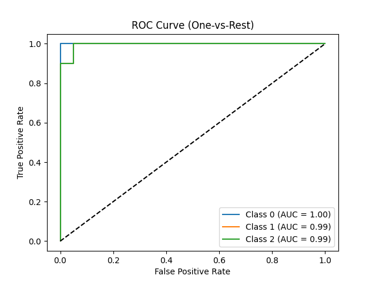

# Iris Classification with Neural Networks

This project trains a neural network to classify iris flowers into three species (setosa, versicolor, virginica) using the Iris dataset. It includes data preparation, model training, inference, testing, and containerization with Docker, producing metrics and visualizations like ROC curves.

## Table of Contents
1. [Project Overview](#project-overview)
2. [Features](#features)
3. [Project Structure](#project-structure)
4. [Prerequisites](#prerequisites)
5. [Setup Instructions](#setup-instructions)
6. [Running the Project](#running-the-project)
7. [Results](#results)
8. [Testing](#testing)
9. [Contributing](#contributing)
10. [License](#license)

## Project Overview
The Iris dataset contains 150 samples with four features (sepal length, sepal width, petal length, petal width) and three classes. This project:
- Prepares data by splitting it into training (120 samples) and inference (30 samples) sets.
- Trains a PyTorch neural network (`IrisNet`) to achieve ~95-98% accuracy.
- Runs inference to predict classes, compute metrics (accuracy, precision, recall, F1-score), and plot ROC curves.
- Uses Docker to ensure reproducible training and inference.
- Includes unit tests to verify data loading and model saving.

## Features
- **Data Preparation**: Generates `train.csv` and `inference.csv` with balanced classes.
- **Neural Network**: Simple architecture (4→16→3 layers) using ReLU activation.
- **Metrics**: Calculates accuracy, precision, recall, F1-score, and AUC for each class.
- **Visualization**: Produces ROC curves to evaluate model performance.
- **Containerization**: Dockerfiles for training and inference pipelines.
- **Testing**: Unit tests for data integrity and pipeline reliability.

## Project Structure
```
iris-classification/
├── data/
│   ├── train.csv           # Training data (120 samples)
│   ├── inference.csv       # Inference data (30 samples)
├── training/
│   ├── train.py            # Trains IrisNet model
│   ├── tests/
│   │   ├── test_train.py   # Tests for train.py
│   ├── Dockerfile          # Docker image for training
├── inference/
│   ├── infer.py            # Runs predictions and metrics
│   ├── tests/
│   │   ├── test_inference.py # Tests for infer.py
│   ├── Dockerfile          # Docker image for inference
├── output/
│   ├── predictions.csv     # Inference predictions
│   ├── metrics.txt         # Accuracy, precision, etc.
│   ├── roc_curve.png       # ROC curve plot
├── prepare_data.py         # Creates train.csv and inference.csv
├── requirements.txt        # Python dependencies
├── README.md               # This file
```

## Prerequisites
- **Python**: 3.9 or higher
- **Docker**: Installed and running
- **Git**: For cloning the repository
- **Hardware**: Basic CPU (GPU optional for faster training)

## Setup Instructions
1. **Clone the Repository**:
   ```bash
   git clone https://github.com/your-username/iris-classification.git
   cd iris-classification
   ```

2. **Set Up Virtual Environment** (optional, for local testing):
   ```bash
   python -m venv .venv
   source .venv/bin/activate  # On Windows: .venv\Scripts\activate
   pip install -r requirements.txt
   ```

3. **Prepare Data**:
   Run `prepare_data.py` to generate `train.csv` and `inference.csv`:
   ```bash
   python prepare_data.py
   ```
   - Creates `data/train.csv` (120 samples) and `data/inference.csv` (30 samples).

## Running the Project
Follow these steps to train the model, run inference, and view results.

1. **Build and Run Training**:
   ```bash
   docker build -f training/Dockerfile -t iris-train .
   docker run --rm -v ${PWD}/models:/app/models -v ${PWD}/data/:/app/data iris-train
   ```
   - Trains `IrisNet` on `train.csv`.
   - Saves `model.pth` to `models/`.
   - Logs accuracy (~95-98%).

2. **Build and Run Inference**:
   ```bash
   docker build -f inference/Dockerfile -t iris-infer .
   docker run --rm -v ${PWD}/inference/output:/app/output -v ${PWD}/data:/app/data iris-infer
   ```
   - Predicts on `inference.csv` using `model.pth`.
   - Saves `predictions.csv`, `metrics.txt`, `roc_curve.png` to `inference/output/`.

3. **View Results**:
   - Check `inference/output/metrics.txt` for accuracy, precision, recall, F1-score.
   - Open `inference/output/roc_curve.png` for the ROC curve plot.

## Results
The model achieves ~96.67% accuracy on the test set during training. Inference results include:

- **Predictions**: `predictions.csv` contains features, true labels, and predicted classes.
- **Metrics**: `metrics.txt` reports:
  - Accuracy: ~0.96
  - Precision, Recall, F1-Score: Weighted averages for multi-class performance.
- **ROC Curve**: Visualizes model performance per class.

**Example ROC Curve**:
  

*Caption*: ROC curves for each iris class, showing AUC scores near 1, indicating strong performance.

**Example Metrics** (from `metrics.txt`):
```
Accuracy: 0.9667
Precision: 0.9667
Recall: 0.9667
F1-Score: 0.9667
```

*Note*: If accuracy is low (e.g., 0.3333), ensure the scaler in `infer.py` matches `train.py` (see [Contributing](#contributing)).

## Testing
Unit tests verify data loading and pipeline functionality.

1. **Install Testing Dependencies**:
   ```bash
   pip install pytest
   ```

2. **Run Training Tests**:
   ```bash
   pytest training/tests/test_train.py -v
   ```
   - Checks `train.csv` exists, has 5 columns, and `train_iris_model()` saves `model.pth`.

3. **Run Inference Tests**:
   ```bash
   pytest inference/tests/test_inference.py -v
   ```
   - Verifies `inference.csv` and `model.pth` exist, and `run_inference()` saves outputs.

## Contributing
Contributions are welcome! To improve the project:
- Fix scaling in `infer.py` to match `train.py` (load saved scaler via `pickle`).
- Update Dockerfiles to copy specific files (e.g., `data/train.csv` instead of `../data`).
- Add more tests or visualizations.

1. Fork the repository.
2. Create a branch: `git checkout -b feature-name`.
3. Commit changes: `git commit -m "Add feature"`.
4. Push: `git push origin feature-name`.
5. Open a pull request.


*Created by Ambekar Tejas*  
*Last Updated: April 2025*


